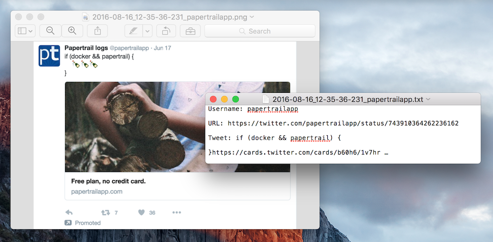

# promo-scraper-alt

An alternative version to `promo-scraper`, which is located [here](https://github.com/louiscenter/promo-scraper).

The original `promo-scraper` was hastily cobbled together using `nightmare`, but I wanted to build `promo-scraper-alt` from scratch using `Electron` (of which `nightmare` is built on top of).

`promo-scraper-alt` will login to your Twitter account, scroll through 5 pages of tweets, and then scrape any promoted tweets that appear. Each tweet is saved into a text file, then an additional screenshot is taken for posterity. This data will appear in the same directory as `promo-scraper-alt`.

Unlike `promo-scraper`, `promo-scraper-alt` will take screenshots of promoted tweets directly from your home timeline, rather than visiting the promoted tweet URL in separate process. I wanted to do this incase `promo-scraper`'s screenshot method was accidentally influencing Twitter's ad delivery algorithm.



## Notes
`promo-scraper-alt` requires Node.js, and was built and tested using Node v5.4.0, on Mac OS X 10.11.6.

`promo-scraper-alt` utilises `electron`, `jsdom`, `map-limit`, and `date-format`.

## Usage

```
$ git clone https://github.com/louiscenter/promo-scraper-alt.git
$ cd promo-scraper-alt
$ npm install
$ npm start <TWITTER_USERNAME> <TWITTER_PASSWORD>
```

## Todo
- [ ] Use selector detection rather than timeouts for login/scrolling
- [ ] Improve error handling

## License
[MIT](https://tldrlegal.com/license/mit-license)
